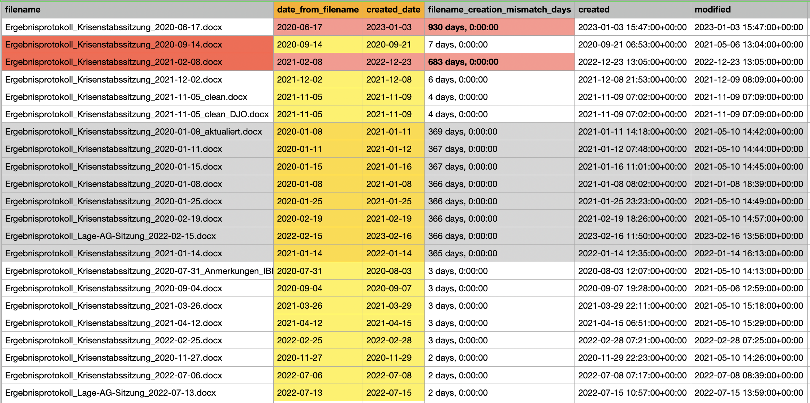
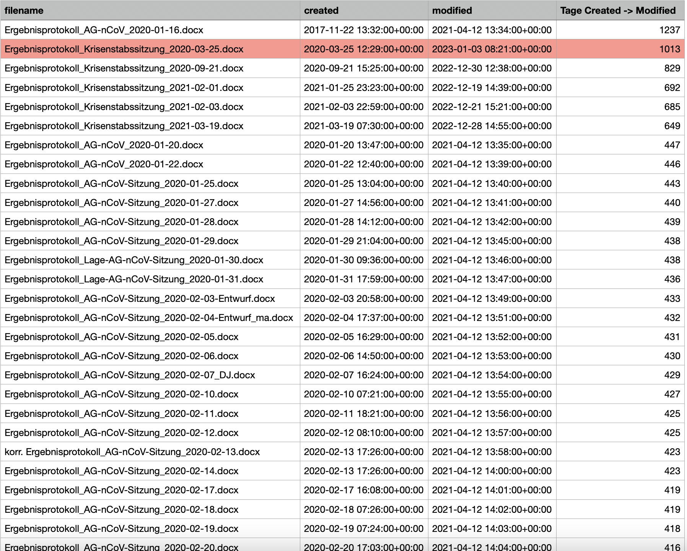

# Analyze Word Metadata in #RKILeak




```console
$ python -m venv env
$ source ./env/bin/activate
$ pip install -r requirements.txt

# copy the leaked documents somewhere here
# in our case: ./Sitzungsprotokolle_orig_docx/
# ...

# convert and create .CSV file
python meta1.py ./Sitzungsprotokolle_orig_docx
```
